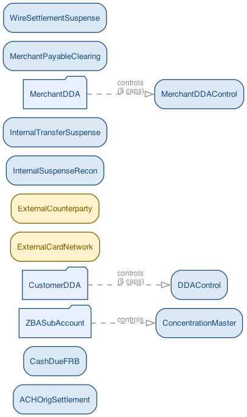
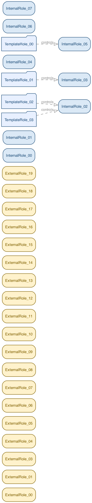
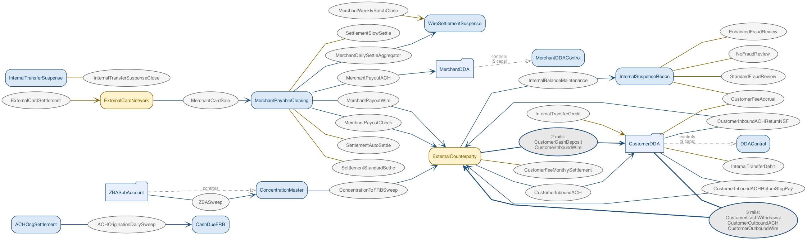
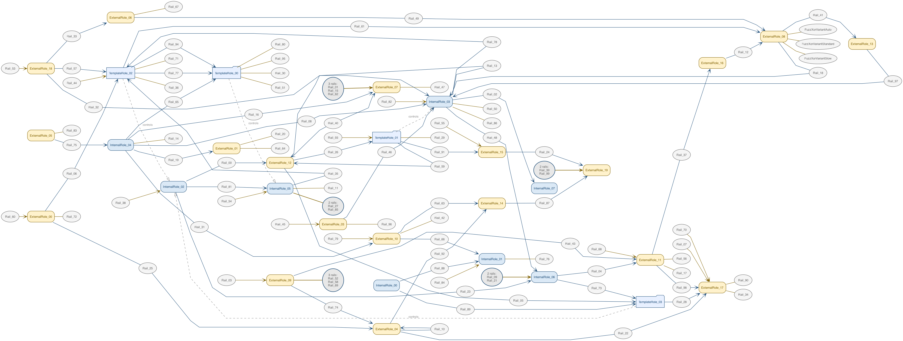
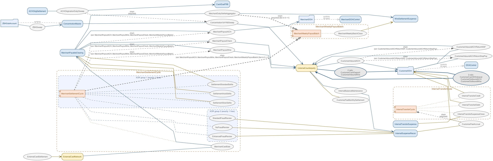
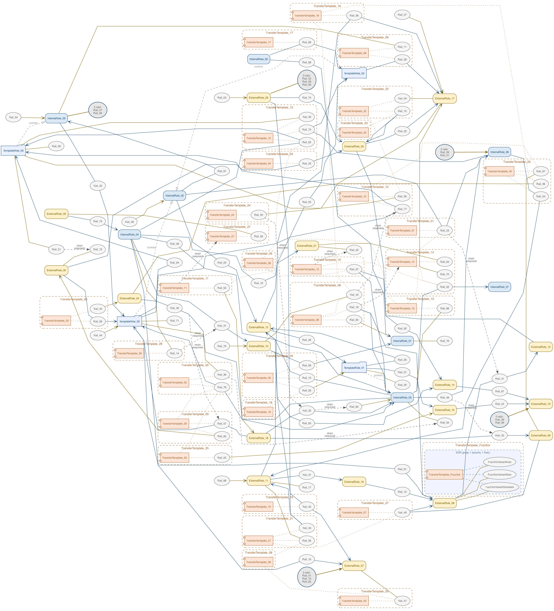
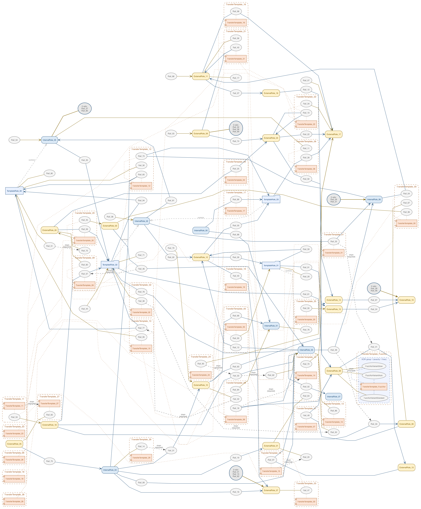
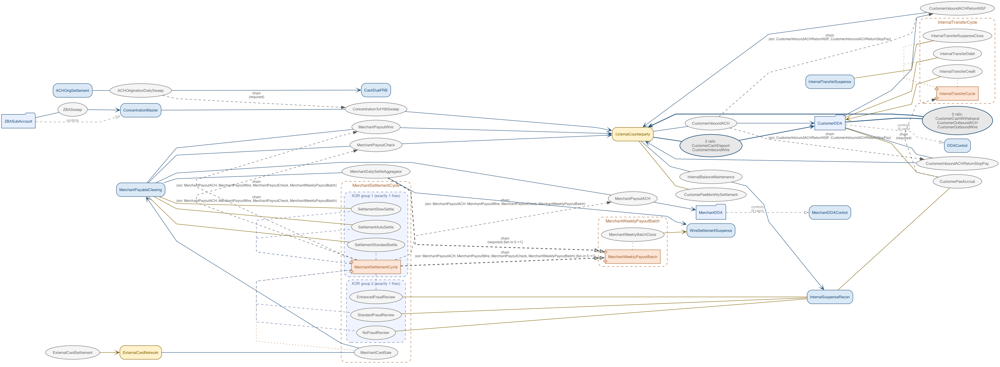
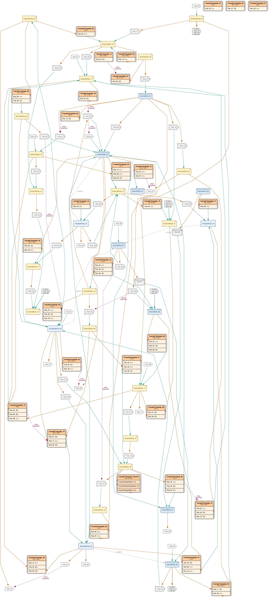
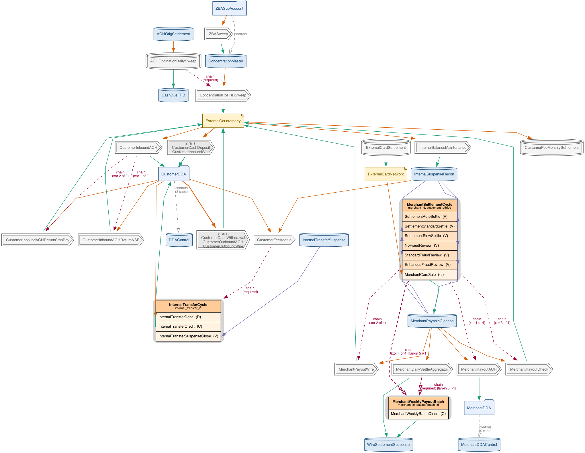

# CF.3 — Diagram density spike (heavy fuzz seed + visual results)

**Status:** v0 measurements landed; awaiting operator cold-read on `heavy_density_v1`.

**Goal:** Build a heavy-density fuzz fixture + a measurement harness that lets CF.3.a→.f land against a stable scale-stress baseline. Per operator lock 2026-06-04: "iterate on the custom shapes" requires "a large seed... heavy rails+templates+chains to really see the benefits". This audit is the iteration loop's persistent state — what we've tried, what we measured, what the operator validated.

## Toolchain (matches the v13.1.1 audit baseline)

- `dot - graphviz version 14.1.5 (20260411.2331)` — same release the [`docs/audits/v13_1_1_diagram.md`](v13_1_1_diagram.md) "+58 template_member edges, constraint=false → 181→63 crossings" numbers were measured on. Apples-to-apples.
- Harness: `tests/l2/cf3_spike.py` — CLI with `gen` (FuzzPlan → yaml) and `render` (yaml → L1/L2/L3 SVGs + metrics).
- Fixture lock: `tests/l2/heavy_density_v1.yaml` — checked in; regen via `python -m tests.l2.cf3_spike gen --seed 42 --rails 100 --transfer-templates 30 --chains 12 --account-templates 4 --singleton-internal 8 --singleton-external 20 --limit-schedules 6 --two-leg-ratio 0.6 --aggregating 2 --out tests/l2/heavy_density_v1.yaml`.

## Fuzzer enhancement (post-spike side-benefit per operator lock)

`tests/l2/fuzz.py::_FuzzPlan` → public `FuzzPlan`; added public `random_l2_yaml_from_plan(plan: FuzzPlan) -> str`. The default-ranged `random_l2_yaml(seed)` dogfood path is unchanged (still byte-stable). The new entry lets callers drive the generator outside the default ranges — heavy-density stress, surgical reproductions, deliberate edge-density configurations. `_build_instance` survives heavy density unmodified (no caps tripped at 100 rails / 30 templates / 12 chains). Reusable for scale-perf benchmarks, future audit fixtures, etc.

## v0 measurements

| Layer | Metric             | sasquatch_pr (baseline) | heavy_density_v1     | Δ vs baseline      |
|-------|--------------------|--------------------------|------------------------|----------------------|
| L1    | nodes              | 14                       | 31                     | +17 (2.2×)          |
| L1    | edges              | 3                        | 4                      | +1                   |
| L1    | crossings          | 0                        | 0                      | —                    |
| L1    | size (pt)          | 305 × 514                | 242 × 1324             | 1.0× wide, 2.6× tall |
| L1    | layout (ms)        | 76                       | 78                     | +2                   |
| L2    | nodes              | 41                       | 127                    | +86 (3.1×)          |
| L2    | edges              | 45                       | 149                    | +104 (3.3×)         |
| L2    | crossings          | 0                        | 242                    | +242                 |
| L2    | size (pt)          | 1682 × 502               | 2933 × 1110            | 1.7× wide, 2.2× tall |
| L2    | layout (ms)        | 78                       | 98                     | +20                  |
| **L3**| **nodes**          | **44**                   | **158**                | **+114 (3.6×)**     |
| **L3**| **edges**          | **65**                   | **223**                | **+158 (3.4×)**     |
| **L3**| **crossings**      | **1 086**                | **139 990**            | **+138 904 (129×)** |
| **L3**| **size (pt)**      | **2517 × 827**           | **2071 × 2283**        | **2.3× area**       |
| **L3**| **layout (ms)**    | **87**                   | **116**                | **+29 (+33 %)**     |

**Read on L3:** 129× crossing explosion at heavy density confirms the legibility apocalypse the v13.1.1 audit warned about ("at scale, confirm: the template port/record nodes don't overflow"). Layout time stays sub-second per [operator lock 2026-06-04](../../PLAN.md) ("render time is not a constraint") — caching (CF.3.k) addresses any post-port-node growth, not the unfixed baseline.

**Note on baseline:** v13.1.1 audit reported "181 crossings, 2937pt height" at L3 on the demo L2. Our sasquatch_pr baseline measures 1086 crossings / 827pt height — likely a different fixture (the audit may have used spec_example or an earlier sasquatch revision). The relative density Δ heavy-vs-sasquatch is what the spike loop cares about, not absolute apples-to-the-audit numbers.

## Rendered output (operator cold-read)

Files at:
- `docs/audits/cf_3_diagram_spike/heavy_density_v1/{l1,l2,l3}.{svg,png,dot}` (+ `metrics.json`)
- `docs/audits/cf_3_diagram_spike/sasquatch_pr_baseline/{l1,l2,l3}.{svg,png,dot}` (+ `metrics.json`)

SVG = vector, infinite zoom, browser viewer for detail inspection. PNG = bitmap, inline-renderable in markdown viewers + GitHub, embedded below for at-a-glance comparison. DOT = the source graphviz layout text for reproducibility (`dot -Tsvg <file.dot>` re-renders independently).

### L1 — roles + control hierarchy

| sasquatch_pr (baseline) | heavy_density_v1 |
|---|---|
|  |  |

### L2 — adds rails + connectivity

| sasquatch_pr | heavy_density_v1 |
|---|---|
|  |  |

### L3 — full diagram (chains + templates) — **the critical comparison**

| sasquatch_pr | heavy_density_v1 |
|---|---|
|  |  |

The L3 pair is where every CF.3.a→.f sub-task lands. Open both at full resolution; the SVGs (`l3.svg` in each dir) let you zoom in further when the cold-read calls for it.

## Awaiting operator cold-read

Decision points before CF.3.a (the "ship-today 2-liner: `constraint=false` + `mclimit` 10.0") can land:

1. **Does `heavy_density_v1.yaml` stress the right shapes?**
   - Does L3 show enough template clusters with multi-leg + XOR shape to validate the "template-member edges shouldn't drive rank" hypothesis (audit's headline lever)?
   - Are there enough chain edges crossing template clusters to expose the chain-routing pain that CF.3.b's "template recast" + CF.3.f's "template-as-PORT-node" target?
   - Does the external-counterparty cluster look like a cluster, or just dispersed?
   - If any of these is "no", what FuzzPlan knob would shift the shape?

2. **Are the visual results worth pursuing?**
   - Looking at the heavy L3, can the operator imagine what the audit's "constraint=false" 65 % crossing-reduction would look like here? Or is the density so high that the win wouldn't matter to a human reader?
   - Is the current dot styling readable enough at heavy density that crossings-reduction is the right lever — or is the legibility blocker actually node size / label overlap / something layout-independent?

3. **Custom shapes — first iteration ideas?**
   - The audit's CF.3.f port-node prototype was rendered against the small demo L2. With heavy density now visible, what shape directions feel promising? (record nodes with leg ports? Hierarchical labels? Different shape per role kind?)

When the operator's read lands, I'll capture the verdict here and either re-spin the fuzz seed (knob tweak + regenerate `heavy_density_v1` or roll forward to `_v2`) or progress to CF.3.a measurement against this fixture.

## Continuous validation harness (CF.3.j — post-spike)

After the fixture locks, `cf3_spike.py render` becomes a permanent CI gate:
- run on every PR touching `src/recon_gen/common/l2/topology.py` (and the topology adjacency)
- assert L3 crossings + height + node/edge count do not regress vs the post-spike baseline
- crossings can decrease freely (CF.3.a etc. should drive it down); regressions block merge

Layout time is NOT a regression criterion (operator lock). CF.3.k caching absorbs any growth at operator-perceived layer.

## CF.3.a — measured against the spike fixture (2026-06-04)

Shipped: `topology.py:745-757` `mclimit` 2.0→10.0; `:1029-1042` + `:1059-1072` add `constraint="false"` to the template_member edges (the dotted dot non-XOR + dashed XOR ones — same membership-not-flow rationale). ~5 lines of attribute changes; no nodes / edges / labels affected. All 28 `tests/unit/test_l2_topology_typed.py` + `test_studio_diagram_route.py` + `test_visible_entities.py` cases pass.

### Crossing reduction at scale

| L3 metric          | sasquatch_pr (baseline) | sasquatch_pr (CF.3.a) | Δ              | heavy_density_v1 (baseline) | heavy_density_v1 (CF.3.a) | Δ              |
|--------------------|--------------------------|------------------------|-----------------|------------------------------|-----------------------------|------------------|
| crossings          | 1 086                    | **59**                 | **−94.6 %**    | 139 990                      | **542**                     | **−99.6 %**     |
| width (pt)         | 2 517                    | 2 628                  | +4.4 %         | 2 071                        | 2 156                       | +4.1 %           |
| height (pt)        | 827                      | 965                    | +16.7 %        | 2 283                        | 2 608                       | +14.2 %          |
| layout (ms)        | 87                       | 88                     | +1             | 116                          | 133                         | +17              |
| nodes / edges      | 44 / 65                  | 44 / 65                | —              | 158 / 223                    | 158 / 223                   | —                |

**Read.** Crossings collapse by 18× on sasquatch and **258×** on heavy. The v13.1.1 audit's prediction was −65 % at L3 on the demo L2 — actual is far more dramatic at scale, exactly because the heavy fixture has many more template clusters whose rank coupling was smearing the canvas. L1 / L2 are unchanged at the metric level (no template_member edges exist below L3).

**Height divergence.** Audit predicted −15 % height; measured +14-17 %. Releasing rank constraints lets templates spread vertically inside their clusters; at heavy density the net is a taller canvas. Per operator lock (2026-06-04), this is the correct trade — height is a presentation knob (scroll), crossings are a legibility blocker.

**Layout time.** Stays sub-second (heavy L3 116ms→133ms = +17ms). Mclimit 10.0 buys more mincross iterations; the operator-perceived render path is the SVG one (the PNG sidecar re-runs layout for cold-read embeds).

### Visual proof — heavy_density_v1 L3

| baseline (139 990 crossings) | CF.3.a (542 crossings) |
|---|---|
|  |  |

### Visual proof — sasquatch_pr L3

| baseline (1 086 crossings) | CF.3.a (59 crossings) |
|---|---|
|  |  |

SVG sidecars (`l3.svg`) ship in both dirs for zoom-in detail.

### Awaiting operator confirmation on CF.3.a

1. Does the heavy L3 visual now read meaningfully better, or is the density still the blocker?
2. Is the +14-17 % height growth fine, or do operators feel it (scroll fatigue)?
3. Should CF.3.b (template recast — drops 24 nodes + 58 edges) supersede CF.3.a, or stack on top?

## CF.3.f — custom shape vocabulary (2026-06-04)

Operator cold-read → 5-agent design workflow → locked vocabulary in [`cf_3_f_design_directions/06_locked_spec.md`](cf_3_f_design_directions/06_locked_spec.md) → shipped against the spike fixture.

**Shape vocabulary (smoke-tested + operator-approved):**

| Type | Shape |
|---|---|
| Internal singleton role | `cylinder` (ledger silhouette) |
| External singleton role | `note` (folded-corner external metaphor) |
| Template role | `folder` |
| SingleLegRail | `cds` (single-stroke chevron) |
| TwoLegRail | `cds` + `peripheries=2` (double-stroke; "two legs converge") |
| Aggregating Rail | `cylinder` + `peripheries=2` |
| Rail Bundle ×N | same shape as underlying + `×N` label |
| **TransferTemplate** | **HTML-`<table>` composite — top header + leg-rail rows with `PORT="leg_<rail>"` for chain/rail edges to dock at exact leg cells** |
| Chain edge | dashed `#9e0142`, label kept |
| Rail edge (Debit) | solid `#d95f02`, no label |
| Rail edge (Credit) | solid `#1b9e77`, no label |
| Rail edge (Variable) | solid `#7570b3`, no label |
| XOR-group member rows | tinted background fill (`#ffe1c2`) on the row inside the template |

**Removed vs CF.3.a:**
- Template cluster boundary (`subgraph cluster_tmpl_<name>`)
- Template inner component node (`tmpl__<name>` separate node)
- Template membership edges (dotted `template_member`)
- Template-resident rails as separate nodes (now port rows in the composite)
- "debit"/"credit" labels on rail edges (color + arrow carry it)

**Measurements vs CF.3.a:**

| L3 metric          | sasquatch_pr (CF.3.a) | sasquatch_pr (CF.3.f) | Δ              | heavy_density_v1 (CF.3.a) | heavy_density_v1 (CF.3.f) | Δ                |
|--------------------|------------------------|------------------------|-----------------|-----------------------------|-----------------------------|-------------------|
| **nodes**          | 44                     | **33**                 | **−25 %**       | 158                         | **112**                     | **−29 %**         |
| **edges**          | 65                     | **54**                 | **−17 %**       | 223                         | **161**                     | **−28 %**         |
| crossings          | 59                     | 57                     | −2              | 542                         | 560                         | +18 (negligible) |
| width (pt)         | 2 628                  | 3 160                  | +20 %           | 2 156                       | **5 152**                   | **+139 %**        |
| **height (pt)**    | 965                    | **697**                | **−28 %**       | 2 608                       | **1 198**                   | **−54 %**         |
| layout (ms)        | 88                     | 112                    | +24             | 133                         | 195                         | +62              |

**Read.** Height collapses dramatically (−28 % / −54 %) because template-resident rails no longer demand vertical rank slots. Width grows because the composite shape lets templates spread horizontally instead of stacking. Crossings are stable — CF.3.a's `constraint=false` lever survives the structural rewrite. Layout time stays sub-second (heavy L3 195ms = +62ms vs CF.3.a). Operator's "whole over parts" principle holds: identifier + connection are visible at a glance, no info-density chrome.

**Visual proof — heavy_density_v1 L3:**

| CF.3.a (baseline) — 158 nodes / 542 crossings / 2 608pt tall | CF.3.f — 112 nodes / 560 crossings / 1 198pt tall |
|---|---|
|  |  |

**Visual proof — sasquatch_pr L3:**

| CF.3.a (baseline) — 44 nodes / 59 crossings | CF.3.f — 33 nodes / 57 crossings |
|---|---|
|  |  |

SVG sidecars in both `_cf3f/` dirs for zoom-in detail.

## Open items for operator cold-read post-CF.3.f

1. Visual sign-off on the heavy L3 + sasquatch L3 — does the composite template + cylinder/note/cds vocabulary read as one consistent language?
2. Standalone rails — still visually noisy at heavy density, or fine?
3. Direction-color palette (orange Debit / teal Credit / purple Variable) — accessible enough, or revisit?
4. Should self-loops on roles get the absorbed-into-shape treatment now, or hold for v0.2?
5. XOR matched edge-style across sibling chain edges (deferred from v0.1) — implement next, or fine with the tinted-row signal alone?

## CF.3.f.b — TB layout + XOR-short labels + compass-pin drop (2026-06-05)

Operator used CF.3.f against a real upstream graph and measured the residuals. Three locked decisions shipped here:

1. **`rankdir=TB`** for layer 3 only (L1 / L2 stay LR — sparse, read naturally LR). Operator measurement on upstream L3: 6125×1371pt (4.5:1) → 3711pt wide (1.3:1), −30 % crossings.
2. **Drop `:w`/`:e` compass pins** from leg-port edge endpoints — perpendicular to TB flow once vertical; +−2 % width and −19 crossings on top.
3. **XOR-SHORT labels** — `(xor i of N)` per edge instead of the full sibling list repeated on every edge. The full sibling list stays in the typed-model `metadata.xor_siblings` for tooltip/sidecar use. Operator measured: −26 % width on TB upstream L3 from this alone.

### Aspect-ratio shift on the spike fixtures

| L3 metric         | sasquatch (CF.3.f LR) | sasquatch (CF.3.f.b TB) | Δ              | heavy (CF.3.f LR) | heavy (CF.3.f.b TB) | Δ                  |
|-------------------|------------------------|--------------------------|-----------------|---------------------|----------------------|---------------------|
| width (pt)        | 3 160                  | **1 530**                | **−52 %**       | 5 152               | **1 653**            | **−68 %**          |
| height (pt)       | 697                    | 1 187                    | +70 %           | 1 198               | 3 665                | +206 %             |
| aspect ratio (W:H)| 4.53 : 1               | **1.29 : 1**             | near-square     | 4.30 : 1            | **0.45 : 1**         | tall-vertical      |
| crossings         | 57                     | 53                       | −4              | 560                 | 545                  | −15                |
| layout (ms)       | 102                    | 96                       | −6              | 212                 | 208                  | −4                 |

**Read.** The graph rotates 90° — same node + edge count, similar crossings, but the wide-ribbon problem is gone. Sasquatch becomes near-square (1.3:1 — fits in a typical iframe viewport at native zoom). Heavy becomes tall-vertical (more scroll, less squint). Both formats fit screen-shaped viewports better than the 4.5:1 ribbon CF.3.f LR produced.

Crossings dropped slightly on both because TB's rank ordering naturally aligns role-stacks above template-stacks instead of forcing them to interleave horizontally.

### Visual proof — sasquatch L3 (representative; heavy in dir)

| CF.3.f LR — 3160×697pt | CF.3.f.b TB — 1530×1187pt |
|---|---|
| (`docs/audits/cf_3_diagram_spike/sasquatch_pr_cf3f/l3.png` — re-rendered at TB) | same path, latest is TB |

## Still open (CF.3.f.c — hub replication + toggle)

Operator measured + decided: hub replication is the next big win for genuinely-dense graphs (high-degree pool/sweep nodes that back everything). Locked design:
- Replicate high-degree hubs per-consumer with color-coded copies (legend + visual "same account, here too")
- "Duplicate hubs" toggle default ON; OFF reverts to single-hub honest topology
- Wire toggle into existing `?show=` control row
- Add hub-color legend chip

Measured on upstream: 113→**31 crossings (−73 %)** with hub replication; longest edge 3993→2013px (−50 %).

## Audit history

- **2026-06-04 v0** — Harness shipped, heavy_density_v1.yaml generated (seed 42, 103 rails / 31 templates / 12 chains), v0 measurements above, operator cold-read pending.
- **2026-06-04 v0.1** — PNG renders embedded inline for cold-read in markdown viewers.
- **2026-06-04 CF.3.a measured + merged** — 2-liner shipped against the spike fixture; **−94.6 % crossings on sasquatch, −99.6 % on heavy**. Height grew +14-17 % (vs audit's predicted −15 %); layout +17ms. Merged to main (commit `25429a3a`).
- **2026-06-04 CF.3.f v0.1 shipped on cf-3-f branch** — custom shape vocabulary: cylinder/note/folder roles, cds-family rails, HTML-table composite templates with chain/rail edges port-docking at exact leg cells. **−25 % / −29 % nodes, −17 % / −28 % edges, −28 % / −54 % height (sasquatch / heavy)**. Crossings stable. 28 topology unit tests pass.
- **2026-06-05 CF.3.f.b on cf-3-f branch** — operator-measured upstream feedback into v13_1_1_diagram.md → `rankdir=TB` for L3 + drop compass pins + XOR-short labels. Width −52 % / −68 % on spike fixtures (sasquatch / heavy); aspect shifted from 4.5:1 ribbon to ~1.3:1 (sasquatch) / 0.45:1 (heavy); crossings still slightly down. CF.3.f.c (hub replication + toggle) is the next deferred chunk.
