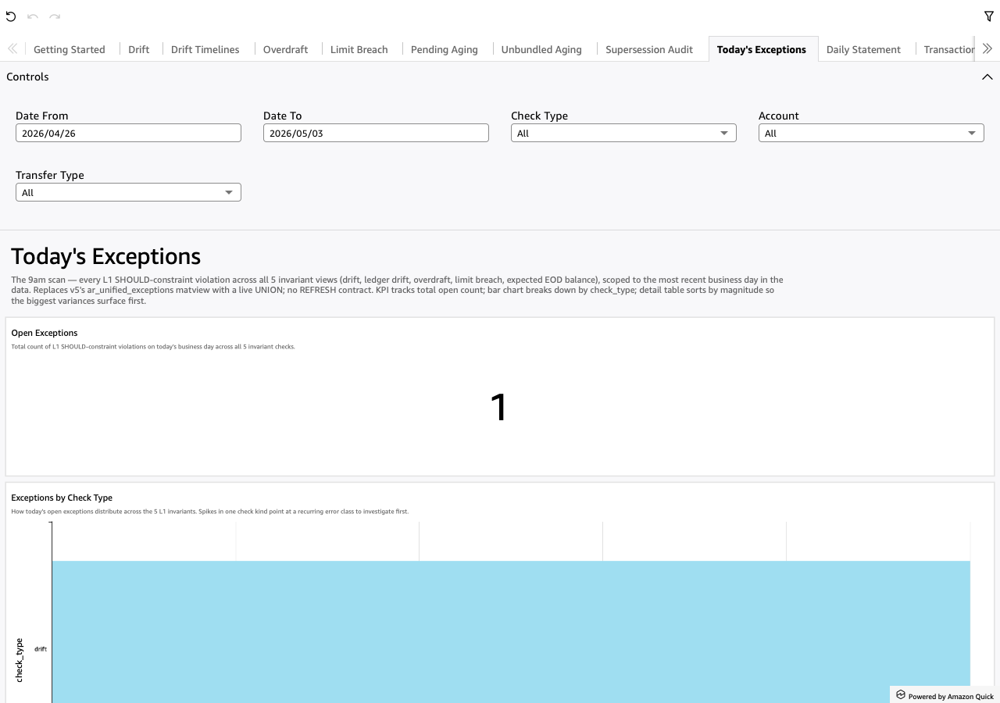

# L1 Exceptions

*Per-sheet walkthrough — L1 Reconciliation Dashboard.*

## What the sheet shows

The 9am scan — did anything break overnight. UNION ALL across the 12 L1
invariant matviews, in three classes:

- **balance / numeric (6)** — `{{ l2_instance_name }}_drift`,
  `{{ l2_instance_name }}_ledger_drift`, `{{ l2_instance_name }}_overdraft`,
  `{{ l2_instance_name }}_limit_breach`,
  `{{ l2_instance_name }}_expected_eod_balance_breach`,
  `{{ l2_instance_name }}_balance_cadence_gap`
- **chain / cardinality (4)** — `{{ l2_instance_name }}_chain_parent_disagreement`,
  `{{ l2_instance_name }}_xor_group_violation`,
  `{{ l2_instance_name }}_fan_in_disagreement`,
  `{{ l2_instance_name }}_multi_xor_violation`
- **time / stuck (2)** — `{{ l2_instance_name }}_stuck_pending`,
  `{{ l2_instance_name }}_stuck_unbundled`

Materialized into `{{ l2_instance_name }}_l1_exceptions` at refresh time, so each
visual reads one small precomputed table instead of re-running the 12-branch
UNION live. Date narrowing happens at the dataset SQL — the matview holds EVERY
day, the picker window (Date From / Date To) pushes down to the rows you asked
for (NOT a fixed latest-day pre-filter).

Magnitude — "how bad is it" — lands in one of two columns depending on the
branch:

- `magnitude_amount` (dollars) for the money branches: `ABS(drift)` for drift /
  ledger_drift / expected_eod_balance_breach, `ABS(stored_balance)` for overdraft
  (how far below zero), `outbound_total - cap` for limit_breach (overflow over the
  cap).
- `magnitude_count` (an integer) for the cardinality branches
  (chain / XOR / fan-in / multi-XOR).

Exactly one is non-NULL per row, so a sort-by-magnitude reads consistently across
check kinds.

??? example "Screenshot"
    

## When to use it

First sheet to open every morning. The KPI answers the only 9am question — did
anything break overnight. From there the bar chart shows the error-class shape,
and the detail table sorts biggest-first so the loudest violations sit at the top.

See it live: https://recon-gen-spec.hotchkiss.io/

## Visuals

- **Open Exceptions** (KPI) — total count of L1 SHOULD-constraint violations in
  the picker's date window, across all 12 invariant checks. Wider window → larger
  count.
- **Exceptions by Check Type** (BarChart, horizontal) — count per check kind
  across the 12 invariants. LOG-scale axis (one kind, typically `stuck_unbundled`,
  otherwise swamps the rest at ~5000 vs near-zero). Spikes in one kind point at a
  recurring error class to investigate first.
- **Exception Detail** (Table) — one row per violation, sorted by
  `magnitude_amount` DESC so the biggest dollar variances are the top rows.
  Transfer-keyed checks carry a `magnitude_count` instead and sort below.
  `rail_name` is NULL on the branches that don't carry it; `transfer_id` is NULL
  on the money branches; `account_parent_role` is NULL on branches that carry no
  parent — all three display blank.
- **Institution Context** (TextBox) — footer with the L2 instance's top-level
  description. Mirrors the Getting Started welcome at the bottom of the
  unified-view landing page.

## Drills

- **Left-click any `account_id`** → narrows the **Drift** sheet to that account
  (`pL1FilterAccount` parameter). Per the CLAUDE.md drill-direction convention, a
  left-click moves you LEFT — back toward the per-invariant source of the
  violation.
- **Right-click → "View Daily Statement for this account-day"** → opens **Daily
  Statement** filtered to the clicked account + business day for the per-leg walk.
  A right-click moves you RIGHT — deeper into the investigation.

## Filters

- **Date From / Date To** — universal date-range pickers (scoped on
  `business_day`).
- **Check Type** — multi-select dropdown over the 12 check kinds.
- **Account** — multi-select dropdown over `account_id`.
- **Transfer Type** — multi-select dropdown over `rail_name`.
